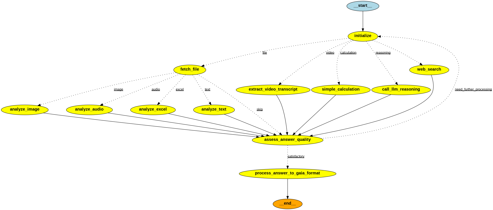

# GAIA Agent - Advanced Multi-Modal AI Assistant

A sophisticated LangGraph-based agent designed to handle complex GAIA (General AI Assistant) evaluation questions with advanced multi-modal capabilities, LLM-based decision making, and robust error handling.

## Purpose

This agent is built to excel at the [GAIA benchmark](https://huggingface.co/gaia-benchmark), which tests AI assistants on real-world questions requiring:

- **Complex reasoning** across multiple domains
- **Multi-modal analysis** (images, audio, video, documents)
- **Tool orchestration** for web search, calculations, and file processing
- **Robust error handling** with intelligent fallback mechanisms
- **GAIA format compliance** with precise answer formatting

## Architecture Overview

The agent uses **LangGraph StateGraph** with conditional edges for intelligent workflow routing, replacing traditional string pattern matching with LLM-based decision making.



### Core Components

#### 1. **LangGraph Workflow Engine** (`src/workflow_agent.py`)
- **StateGraph with conditional edges** for intelligent routing
- **LLM-based gate functions** for workflow decisions
- **Multi-step processing** with quality assessment
- **Automatic error recovery** and fallback routing

#### 2. **Tool Suite** (`src/tools/`)

**Research & Analysis:**
- **Web Search** (Tavily API integration)
- **LLM Reasoning** for complex analysis

**File Processing:**
- **Image Analysis** (GPT-4 Vision for chess, charts, visual content)
- **Audio Transcription** (OpenAI Whisper with fallbacks)
- **Spreadsheet Analysis** (Excel/CSV with pandas)
- **Document Processing** (PDF, text files)
- **YouTube Video Analysis** (transcript extraction)

**Computation:**
- **Code Execution** (smolagents CodeAgent for safe Python)
- **Mathematical Calculations** with expression evaluation
- **Text Processing** (reverse text, decode puzzles)

**Quality Assurance:**
- **Answer Verification** (GAIA format compliance)
- **Quality Assessment** with LLM evaluation

#### 3. **Intelligent Gate Functions** (`src/gate_functions.py`)
LLM-powered routing decisions with multi-shot prompts:

- **`determine_next_step()`** - Routes to appropriate processing (math, video, file, web search, reasoning)
- **`assess_answer_quality()`** - Evaluates completeness with math-specific logic and LLM assessment
- **`route_file_analysis()`** - Handles images, audio, Excel, text files based on type and question
- **`should_continue_processing()`** - Intelligent termination decisions

## Key Features

### **Multi-Modal Capabilities**
- **Image Analysis**: Chess positions, charts, diagrams, visual content
- **Audio Processing**: Automatic transcription with multiple fallback methods
- **Video Analysis**: YouTube transcript extraction and content analysis
- **Spreadsheet Processing**: Excel/CSV data analysis and calculations
- **Document Analysis**: PDF and text file processing

### **Intelligent Decision Making**
- **LLM-based routing** instead of brittle string matching
- **Context-aware tool selection** based on question type and available files
- **Quality-driven processing** with automatic retry and improvement logic
- **Math-specific optimizations** for quick numerical answer recognition

### **Robust Error Handling**
- **YouTube transcript fallback**: Routes to web search when transcripts fail
- **Audio transcription fallback**: Multiple methods with intelligent degradation
- **File processing resilience**: Handles missing files and format issues
- **Infinite loop prevention**: Smart termination with step and retry limits

### **GAIA Format Compliance**
- **Strict formatting rules**: No abbreviations, proper number formatting
- **Answer verification**: Ensures compliance with GAIA specifications
- **Raw answer output**: Clean responses without prefixes

## Technical Implementation

### **LangGraph Conditional Edges**
```python
# Intelligent routing based on LLM decisions
workflow.add_conditional_edges(
    "initialize",
    determine_next_step,  # LLM-based routing
    {
        "file": "fetch_file",
        "video": "extract_video_transcript", 
        "calculation": "simple_calculation",
        "reasoning": "call_llm_reasoning",
        "web_search": "web_search",
    },
)
```

### **Tool Selection Logic**
```python
# Context-aware file processing
workflow.add_conditional_edges(
    "fetch_file",
    route_file_analysis,  # LLM analyzes file type + question
    {
        "image": "analyze_image",
        "audio": "analyze_audio", 
        "excel": "analyze_excel",
        "text": "analyze_text",
        "skip": "assess_answer_quality",
    },
)
```

### **Quality Assessment**
```python
# Multi-factor quality evaluation
workflow.add_conditional_edges(
    "assess_answer_quality",
    assess_answer_quality,  # Math detection + LLM assessment
    {
        "satisfactory": "process_answer_to_gaia_format",
        "need_further_processing": "initialize",  # Loop back
    },
)
```

## Setup & Installation

### **Prerequisites**
- Python 3.11+
- **Required API Keys** (at least one):
  - `OPENAI_API_KEY` or `ANTHROPIC_API_KEY` (llm provider)
  - `TAVILY_API_KEY` (for web search)

### **Installation**
```bash
# Install dependencies
uv sync

# Set up environment
cp .env.example .env
# Add your API keys to .env

# Run the application
uv run python app.py
```

### **Environment Configuration**
```env
OPENAI_API_KEY=your_openai_key_here
ANTHROPIC_API_KEY=your_anthropic_key_here  
TAVILY_API_KEY=your_tavily_key_here
MAX_PARALLEL_QUESTIONS=3
```

## Testing & Validation

### **Test Suite**
```bash
# Run tool tests
uv run pytest src/tools/tests/ -v

# Test specific components
uv run python -m pytest src/tools/tests/test_youtube_analyzer.py -v
uv run python -m pytest src/tools/tests/test_audio_analyzer.py -v
```

### **Manual Testing**
```bash
# Test workflow visualization
uv run python visualize_workflow.py

# Test with sample questions (uncomment/add to the questions list)
uv run python test_workflow_agent.py
```

## GAIA Question Types Supported

### **Mathematical & Computational**
- smolagents CodeAgent for safe Python code execution

### **Research & Factual**
- Web search for current information

### **File-Based Analysis**
- **Images**: Chess positions, charts, diagrams, visual puzzles
- **Audio**: Speech transcription and content analysis  
- **Video**: YouTube content analysis via transcripts
- **Spreadsheets**: Data analysis, calculations, trend identification
- **Documents**: PDF/text extraction and analysis

### **Complex Reasoning**
- Multi-step logical reasoning
- Cross-domain knowledge synthesis
- Contextual analysis and inference

## Performance Features

### **Parallel Processing**
- **Async question processing** with configurable concurrency
- **3-5x speedup** for batch evaluations
- **Real-time progress tracking** with live updates
- **Error isolation** - individual failures don't stop evaluation

### **Optimization Strategies**
- **Math question fast-path**: Quick recognition of numerical answers
- **Tool result caching**: Avoid redundant API calls
- **Smart termination**: Quality-based early stopping
- **Fallback routing**: Automatic recovery from tool failures

## Deployment

### **Hugging Face Spaces**
The agent is designed for seamless deployment on [Hugging Face Spaces](https://huggingface.co/spaces) with:

- **Automatic environment detection**
- **OAuth integration** for user authentication
- **Scalable evaluation** with parallel processing
- **Real-time progress display**

### **Local Development**
```bash
# Development mode
uv run python app.py

# Check environment status
uv run python -c "from src.config import Config; Config.print_status()"
```

## Project Structure

```
src/
 workflow_agent.py      # Main LangGraph workflow
 gate_functions.py      # LLM-based routing decisions  
 tools/                 # Tool suite
    web_search.py      # Tavily API integration
    image_analyzer.py  # GPT-4 Vision analysis
    audio_analyzer.py  # Whisper transcription
    youtube_analyzer.py # Video transcript analysis
    spreadsheet_analyzer.py # Excel/CSV processing
    code_agent.py      # Safe Python code execution
    answer_verifier.py # GAIA format compliance
    tests/             # Comprehensive test suite
 config.py              # Environment & API configuration
 llm_provider.py        # Multi-provider LLM interface
```