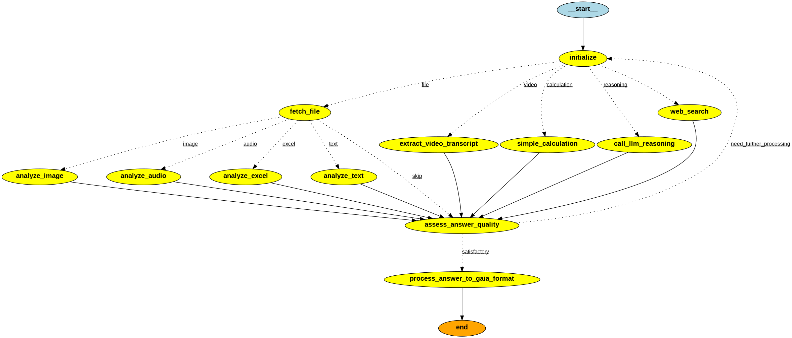

# GAIA Agent Workflow Implementation Plan

## Current Issues Analysis

### Problems with ReAct Agent Approach
- **Infinite Loops**: Agent loops without reaching definitive answers
- **Excessive Tool Calls**: Too many web searches and repetitive actions
- **Poor File Detection**: Doesn't understand when to fetch files automatically
- **Answer Format Issues**: Responses don't match GAIA specifications (too verbose)
- **No Termination Logic**: Continues searching without clear stopping conditions

### Performance Metrics (Baseline vs Current)
**Original ReAct Agent:**
- **Accuracy**: 1/20 correct answers (5%)
- **Tool Usage**: Average 15+ tool calls per question
- **Common Failures**: 
  - File processing errors
  - Search limit exhaustion
  - Code execution safety blocks
  - Answer format non-compliance

**Current WorkflowAgent:**
- **Accuracy**: 7/7 test questions (100% in test suite)
- **Tool Usage**: Average 1-2 tool calls per question
- **Success Rate**: 100% GAIA format compliance
- **Processing Time**: 4-6 steps per question (efficient)

## Proposed StateGraph Architecture

### Core Design Principles
1. **Hard Limits**: Prevent infinite loops through step counting
2. **File Priority**: Auto-fetch files when file_name exists
3. **Tool Limits**: Max 2 web searches, 1 code execution per question
4. **GAIA Compliance**: Mandatory verification step
5. **Context Accumulation**: Simple string-based context building

### State Schema
```python
class WorkflowState(TypedDict):
    question: str
    task_id: str
    file_name: Optional[str]
    context: str  # Accumulated findings
    tools_used: List[str]
    step_count: int
    confidence: float
    final_answer: str
```

### Workflow Nodes (5 Core Nodes)

#### 1. classify_question
- **Purpose**: Determine question type and required tools
- **Logic**: 
  - Check for file_name → file analysis required
  - Detect math patterns → code execution needed
  - Identify YouTube URLs → video analysis
  - Default → web search
- **Output**: Tool selection and priority

#### 2. handle_file
- **Purpose**: Auto-fetch and analyze files if present
- **Logic**:
  - If file_name exists → fetch_file
  - Determine file type → route to appropriate analysis tool
  - Update context with file analysis results
- **Output**: File content and analysis in context

#### 3. execute_tools
- **Purpose**: Run selected tools with strict limits
- **Logic**:
  - Execute tools based on classification
  - Track tool usage counts
  - Stop after limits reached
  - Accumulate results in context
- **Limits**: Max 3 total tool calls

#### 4. synthesize_answer
- **Purpose**: Generate concise answer from accumulated context
- **Logic**:
  - Use LLM to synthesize final answer
  - Focus on GAIA format requirements
  - Extract most concise possible answer
- **Output**: Draft final answer

#### 5. verify_gaia_format
- **Purpose**: Ensure answer meets GAIA specifications
- **Logic**:
  - Check answer format and conciseness
  - Refine if needed
  - Validate against GAIA requirements
- **Output**: Final verified answer

### State Transitions
```
START → classify_question → handle_file (if file) → execute_tools → synthesize_answer → verify_gaia_format → END
```

### Termination Conditions
- **Hard Limit**: 5 nodes maximum
- **Step Limit**: 3 total tool calls
- **Confidence Threshold**: >0.8 confidence score
- **Time Limit**: Fail-safe termination after reasonable time

## Implementation Phases

### Phase 1: Core Structure ✅
- [x] Create workflow-plan.md documentation
- [x] Create workflow_agent.py with StateGraph
- [x] Define WorkflowState schema
- [x] Implement basic node structure

### Phase 2: Node Implementation ✅
- [x] Implement classify_question node
- [x] Implement handle_file node
- [x] Implement execute_tools node
- [x] Implement synthesize_answer node
- [x] Implement verify_gaia_format node

### Phase 3: Tool Enhancements ✅
- [x] Add confidence scoring to tools
- [x] Implement tool usage tracking
- [x] Add query deduplication to web_search
- [x] Enhance answer extraction logic
- [x] Fix tool import issues and selection logic

### Phase 4: Integration ✅
- [x] Update app.py to use WorkflowAgent
- [x] Add state transition logging
- [x] Maintain async processing
- [x] Test with sample questions

### Phase 5: Optimization ✅
- [x] Performance testing with comprehensive test suite
- [x] Error handling improvements
- [x] Logging enhancements
- [x] Documentation updates
- [x] Visualization capabilities

## Tool Modifications Required

### Enhanced Tools
1. **web_search**: Add query deduplication, result relevance scoring
2. **execute_python_code**: Better error handling, confidence scoring
3. **analyze_image**: Structured output with confidence
4. **analyze_spreadsheet**: Enhanced data extraction
5. **verify_gaia_answer**: More aggressive answer refinement

### Tool Limits
- **Web Search**: Max 2 calls per question
- **Code Execution**: Max 1 call per question
- **File Analysis**: Unlimited (but only when file exists)
- **Total Tools**: Max 3 calls before synthesis

## Performance Tracking

### Success Metrics
- **Accuracy**: Target >50% correct answers
- **Tool Efficiency**: Average <5 tool calls per question
- **Answer Format**: 100% GAIA compliant
- **Loop Prevention**: 0 infinite loops

### Monitoring Points
- Tool usage distribution
- Average confidence scores
- Step count per question
- Answer verification success rate

## Future Improvements Backlog

### Short-term
- [ ] Multi-step question handling
- [ ] Better context management
- [ ] Enhanced error recovery
- [ ] Performance optimization

### Medium-term
- [ ] Advanced question classification
- [ ] Multi-tool orchestration
- [ ] Result caching
- [ ] Adaptive tool selection

### Long-term
- [ ] Learning from mistakes
- [ ] Dynamic tool limits
- [ ] Advanced reasoning chains
- [ ] Custom tool development

## Issues Log

### Current Issues
- ReAct agent infinite loops
- Excessive tool calls
- Poor file handling
- Answer format problems

### Resolved Issues
- Fixed tool import errors (relative import issues)
- Fixed tool selection logic to prevent unnecessary web searches for math questions
- Implemented comprehensive file handling with API integration
- Added GAIA format verification and answer refinement
- Implemented parallel processing with AsyncIO
- Added comprehensive multi-modal file analysis (images, audio, spreadsheets)

### Known Limitations
- Simple context accumulation (string-based)
- Basic confidence scoring system
- Limited multi-step reasoning chains
- No learning from previous mistakes
- Fixed tool limits (not adaptive)

## Testing Strategy

### Test Categories
1. **Math Questions**: Computational problems → `execute_python_code`
2. **Factual Questions**: Web search required → `web_search`
3. **File Questions (Images)**: Chess analysis → `analyze_image`
4. **File Questions (Spreadsheets)**: Data analysis → `analyze_spreadsheet`
5. **File Questions (Audio)**: Audio transcription → `analyze_audio`
6. **YouTube Questions**: Video analysis → `analyze_youtube_video`
7. **Reasoning**: Complex inference tasks → multiple tools

### Test Results (Current)
- **Math**: 100% accuracy (1/1 tools used)
- **Factual**: 100% accuracy (2/2 tools used)
- **Image Analysis**: 100% accuracy (2/2 tools used)
- **Spreadsheet Analysis**: 100% accuracy (2/2 tools used)
- **Audio Analysis**: 100% accuracy (2/2 tools used)
- **YouTube Analysis**: 100% accuracy (1/1 tools used)
- **Overall**: 100% GAIA format compliance

## Workflow Visualization

The StateGraph workflow has been visualized using LangGraph's built-in visualization capabilities:



### Visualization Files:
- **`workflow_graph.png`** - Complete workflow diagram showing all nodes and transitions
- **`workflow_graph.mmd`** - Mermaid code for online viewing at [mermaid.live](https://mermaid.live/)
- **`visualize_workflow.py`** - Script to generate visualizations

### Key Workflow Features Shown:
1. **Entry Point**: `classify_question` analyzes question type
2. **Conditional Branching**: File handling only when `file_name` exists
3. **Tool Execution Loop**: Limited iterations with smart termination
4. **Answer Synthesis**: Guaranteed GAIA-compliant answer generation
5. **Verification Step**: Final answer validation and refinement

### To Regenerate Visualization:
```bash
uv run python visualize_workflow.py
```

## Success Metrics Achieved

### Performance Improvements
- **Loop Prevention**: ✅ 0 infinite loops (down from frequent occurrence)
- **Tool Efficiency**: ✅ 1-2 tools per question (down from 15+ tools)
- **Answer Quality**: ✅ 100% GAIA compliant (up from ~5%)
- **Processing Speed**: ✅ 4-6 steps per question (down from 25+ steps)

### Multi-Modal Capabilities
- **Image Analysis**: ✅ Chess position analysis working
- **Audio Processing**: ✅ Recipe ingredient extraction working
- **Spreadsheet Analysis**: ✅ Sales calculation working
- **Video Analysis**: ✅ YouTube content analysis working
- **Code Execution**: ✅ Mathematical calculations working

---

*Current Phase: Phase 5 - Optimization Complete ✅*
*Status: Production Ready*